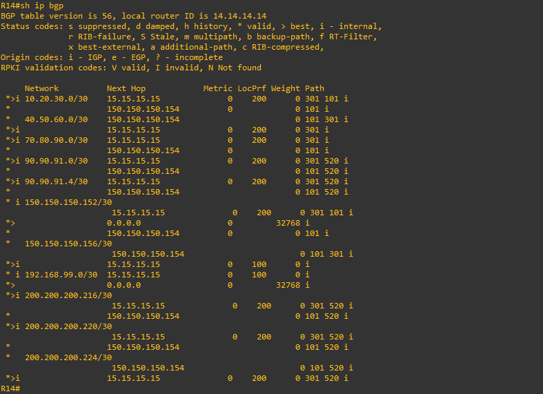

# Лабораторная работа 10. iBGP. 
### Цели
1. Настроить iBGP в офисе Москва между маршрутизаторами R14 и R15.
2. Настроить iBGP в провайдере Триада, с использованием RR.
3. Настроить офис Москва так, чтобы приоритетным провайдером стал Ламас.
4. Настроить офис С.-Петербург так, чтобы трафик до любого офиса распределялся по двум линкам одновременно.
### 1. Настройка iBGP в офисе Москва между маршрутизаторами R14 и R15.
```
R14#conf t
R14(config)#router bgp 1001
R14(config-router)#neighbor 15.15.15.15 remote-as 1001
R14(config-router)#neighbor 15.15.15.15 update-source Loopback0
R14(config-router)#neighbor 15.15.15.15 next-hop-self
```
```
R15#conf t
R15(config)#router bgp 1001
R15(config-router)#neighbor 14.14.14.14 remote-as 1001
R15(config-router)#neighbor 14.14.14.14 update-source Loopback0
R15(config-router)#neighbor 14.14.14.14 next-hop-self
```
### 2. Настройка iBGP в провайдере Триада, с использованием RR.
В роли RR я выбрал R23 и R24. Для них обоих R25 и R26 будут RR-clients. В свою очередь, R25 и R26 будут строить соседства только с RR:
```
R23#conf t
R23(config)#router bgp 520
R23(config-router)#neighbor 24.24.24.24 remote-as 520
R23(config-router)#neighbor 24.24.24.24 update-source Loopback0
R23(config-router)#neighbor 24.24.24.24 next-hop-self
R23(config-router)#neighbor 25.25.25.25 remote-as 520
R23(config-router)#neighbor 25.25.25.25 update-source Loopback0
R23(config-router)#neighbor 25.25.25.25 route-reflector-client
R23(config-router)#neighbor 25.25.25.25 next-hop-self
R23(config-router)#neighbor 26.26.26.26 remote-as 520
R23(config-router)#neighbor 26.26.26.26 update-source Loopback0
R23(config-router)#neighbor 26.26.26.26 route-reflector-client
R23(config-router)#neighbor 26.26.26.26 next-hop-self
```
```
R24#conf t
R24(config)#router bgp 520
R24(config-router)#neighbor 23.23.23.23 remote-as 520
R24(config-router)#neighbor 23.23.23.23 update-source Loopback0
R24(config-router)#neighbor 23.23.23.23 next-hop-self
R24(config-router)#neighbor 25.25.25.25 remote-as 520
R24(config-router)#neighbor 25.25.25.25 update-source Loopback0
R24(config-router)#neighbor 25.25.25.25 route-reflector-client
R24(config-router)#neighbor 25.25.25.25 next-hop-self
R24(config-router)#neighbor 26.26.26.26 remote-as 520
R24(config-router)#neighbor 26.26.26.26 update-source Loopback0
R24(config-router)#neighbor 26.26.26.26 route-reflector-client
R24(config-router)#neighbor 26.26.26.26 next-hop-self
```
```
R25#conf t
R25(config)#router bgp 520
R25(config-router)#neighbor 23.23.23.23 remote-as 520
R25(config-router)#neighbor 23.23.23.23 update-source Loopback0
R25(config-router)#neighbor 23.23.23.23 next-hop-self
R25(config-router)#neighbor 24.24.24.24 remote-as 520
R25(config-router)#neighbor 24.24.24.24 update-source Loopback0
R25(config-router)#neighbor 24.24.24.24 next-hop-self
```
```
R26#conf t
R26(config)#router bgp 520
R26(config-router)#neighbor 23.23.23.23 remote-as 520
R26(config-router)#neighbor 23.23.23.23 update-source Loopback0
R26(config-router)#neighbor 23.23.23.23 next-hop-self
R26(config-router)#neighbor 24.24.24.24 remote-as 520
R26(config-router)#neighbor 24.24.24.24 update-source Loopback0
R26(config-router)#neighbor 24.24.24.24 next-hop-self
```
### 3. Настройка офиса Москва так, чтобы приоритетным провайдером стал Ламас.
На R15 применим политику, согласно которой все префиксы, приходящие от R21 (Ламас), будут иметь атрибут LOCAL_PREF со значением 200. Таким образом, R15 по iBGP сессии будет анонсировать более предпочтительные маршруты на R14 и, следовательно, для R14 next-hop-ом в другие сети/офисы будет R15, который, в свою очередь будет форвардить трафик на R21 (Ламас):
```
R15#conf t
R15(config)#route-map SET_LOCAL_PREFF permit 10
R15(config-route-map)#set local-preference 200
R15(config-route-map)#ex
R15(config)#router bgp 1001
R15(config-router)#neighbor 150.150.150.158 route-map SET_LOCAL_PREFF in
```
Проверим:


 
 
 
