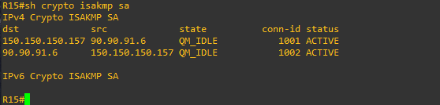
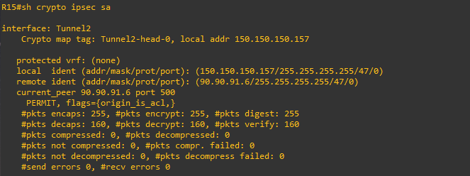
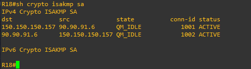
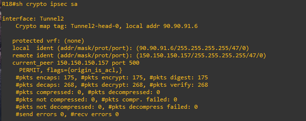
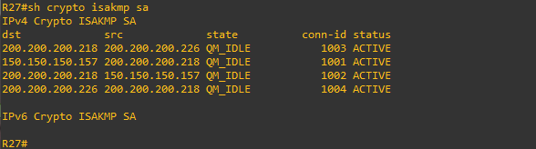
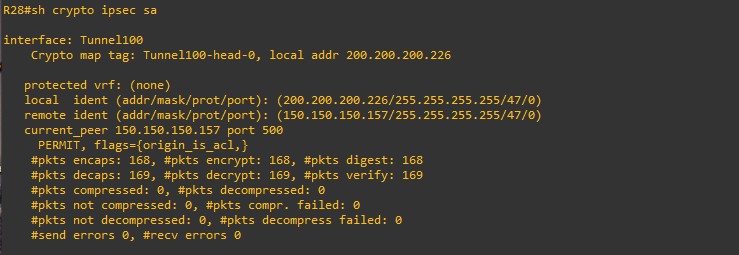
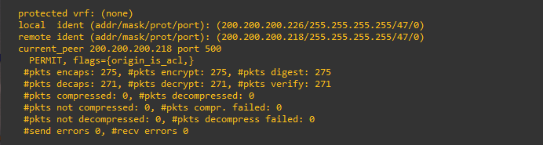
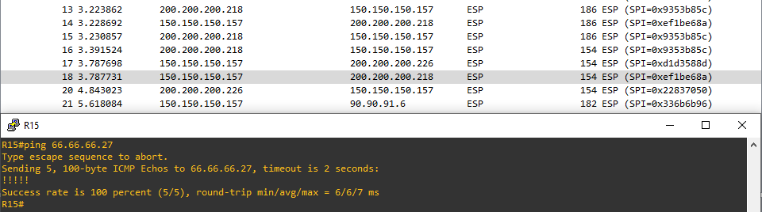

# Лабораторная работа 14. IPsec over DMVPN
### Цели
1. Настроить GRE поверх IPSec между офисами Москва и С.-Петербург.
2. Настроить DMVPN поверх IPSec между Москва и Чокурдах, Лабытнанги.
### 1. Настроить GRE поверх IPSec между офисами Москва и С.-Петербург.
Сперва настроим IPsec на R15:
```
R15#conf t
R15(config)#crypto isakmp policy 10
R15(config-isakmp)#encryption aes 256
R15(config-isakmp)#authentication pre-share
R15(config-isakmp)#group 14
R15(config-isakmp)#ex
R15(config)#crypto isakmp key MY_KEY address 90.90.91.6
R15(config)#crypto ipsec transform-set SITE-TO_SITE esp-aes esp-sha-hmac
R15(cfg-crypto-trans)#ex
R15(config)#crypto ipsec profile SITE-TO-SITE-PROFILE
R15(ipsec-profile)#set transform-set SITE-TO_SITE
R15(ipsec-profile)#ex
R15(config)#interface tunnel 2
R15(config-if)#tunnel protection ipsec profile SITE-TO-SITE-PROFILE
```
Теперь настроим IPsec на R18:
```
R18#conf t
R18(config)#crypto isakmp policy 10
R18(config-isakmp)#encryption aes 256
R18(config-isakmp)#authentication pre-share
R18(config-isakmp)#group 14
R18(config-isakmp)#ex
R18(config)#crypto isakmp key MY_KEY address 150.150.150.157
R18(config)#crypto ipsec transform-set SITE-TO-SITE esp-aes esp-sha-hmac
R18(cfg-crypto-trans)#ex
R18(config)#crypto ipsec profile SITE-TO-SITE-PROFILE
R18(ipsec-profile)#set transform-set SITE-TO-SITE
R18(ipsec-profile)#ex
R18(config)#int tunnel 2
R18(config-if)#tunnel protection ipsec profile SITE-TO-SITE-PROFILE
```
Проверим IPsec туннель:  






### 2. Настроить DMVPN поверх IPSec между Москва и Чокурдах, Лабытнанги.
На R15, R27 и R28 делаем все то же самое, что и до этого:
```
R15#conf t
R15(config)#crypto isakmp policy 10
R15(config-isakmp)#encryption aes 256
R15(config-isakmp)#authentication pre-share
R15(config-isakmp)#group 14
R15(config-isakmp)#ex
R15(config)#crypto isakmp key DMVPN_KEY address 0.0.0.0 0.0.0.0
R15(config)#$c transform-set DMVPN_TRANSFORM esp-aes 256 esp-sha256-hmac
R15(cfg-crypto-trans)#mode transport
R15(cfg-crypto-trans)#ex
R15(config)#crypto ipsec profile DMVPN_PROFILE
R15(ipsec-profile)#set transform-set DMVPN_TRANSFORM
R15(ipsec-profile)#ex
R15(config)#int tunnel 100
R15(config-if)#tunnel protection ipsec profile DMVPN_PROFILE
R15(config-if)#end
```
```
R27#conf t
R27(config)#crypto isakmp policy 10
R27(config-isakmp)#encryption aes 256
R27(config-isakmp)#authentication pre-share
R27(config-isakmp)#group 14
R27(config-isakmp)#ex
R27(config)#crypto isakmp key DMVPN_KEY address 0.0.0.0 0.0.0.0
R27(config)#$c transform-set DMVPN_TRANSFORM esp-aes 256 esp-sha256-hmac
R27(cfg-crypto-trans)#mode transport
R27(cfg-crypto-trans)#ex
R27(config)#crypto ipsec profile DMVPN_PROFILE
R27(ipsec-profile)#set transform-set DMVPN_TRANSFORM
R27(ipsec-profile)#ex
R27(config)#int tunnel 100
R27(config-if)#tunnel protection ipsec profile DMVPN_PROFILE
```
```
R28#conf t
R28(config)#crypto isakmp policy 10
R28(config-isakmp)#encryption aes 256
R28(config-isakmp)#authentication pre-share
R28(config-isakmp)#group 14
R28(config-isakmp)#ex
R28(config)#crypto isakmp key DMVPN_KEY address 0.0.0.0 0.0.0.0
R28(config)#$c transform-set DMVPN_TRANSFORM esp-aes 256 esp-sha256-hmac
R28(cfg-crypto-trans)#mode transport
R28(cfg-crypto-trans)#ex
R28(config)#crypto ipsec profile DMVPN_PROFILE
R28(ipsec-profile)#set transform-set DMVPN_TRANSFORM
R28(ipsec-profile)#ex
R28(config)#int tunnel 100
R28(config-if)#tunnel protection ipsec profile DMVPN_PROFILE
```
Проверка:  






### Дополнительно использовать сертификаты
В таком случае мы вместо PRE SHARED KEY будем использовать сертификаты. CA настраивается следующим образом:
```
R15#conf t
R15(config)#ip domain name otus.ru
R15(config)#ip http server
R15(config)#$generate rsa general-keys label R15 modulus 2048 exportable
R15(config)#crypto pki server R15
R15(cs-server)#no shutdown
%Some server settings cannot be changed after CA certificate generation.
% Please enter a passphrase to protect the private key
% or type Return to exit
Password:

Re-enter password:
% Exporting Certificate Server signing certificate and keys...

% Certificate Server enabled.
R15(cs-server)#database level complete
R15(cs-server)#ex
R15(config)#
R15#
R15#crypto pki server R15 grant all
```
Клиенты:
```
R27#conf t
R27(config)#ip domain name otus.ru
R27(config)#ip host R15 66.66.66.1
R27(config)#crypto key generate rsa
The name for the keys will be: R27.otus.ru
Choose the size of the key modulus in the range of 360 to 4096 for your
  General Purpose Keys. Choosing a key modulus greater than 512 may take
  a few minutes.

How many bits in the modulus [512]: 2048
% Generating 2048 bit RSA keys, keys will be non-exportable...
[OK] (elapsed time was 1 seconds)

R27(config)#
R27(config)#crypto pki trustpoint R15
R27(ca-trustpoint)#enrollment url http://R15:80
R27(ca-trustpoint)#ex
R27(config)#crypto pki authenticate R15
Certificate has the following attributes:
       Fingerprint MD5: 979BE6A5 2226EAC1 A2260B6C 571F7836
      Fingerprint SHA1: D6620F05 29B7BC6B AC4F903B 628D4CBD CA41B3A5

% Do you accept this certificate? [yes/no]: yes
Trustpoint CA certificate accepted.
R27(config)#
R27(config)#crypto pki enroll R15
%
% Start certificate enrollment ..
% Create a challenge password. You will need to verbally provide this
   password to the CA Administrator in order to revoke your certificate.
   For security reasons your password will not be saved in the configuration.
   Please make a note of it.

Password:
Re-enter password:

% The subject name in the certificate will include: R27.otus.ru
% Include the router serial number in the subject name? [yes/no]: yes
% The serial number in the certificate will be: 67109296
% Include an IP address in the subject name? [no]: yes
Enter Interface name or IP Address[]:
% Skipping IP address

Request certificate from CA? [yes/no]: yes
% Certificate request sent to Certificate Authority
% The 'show crypto pki certificate verbose R15' commandwill show the fingerprint.

R27(config)#crypto isakmp enable
R27(config)#crypto isakmp policy 10
R27(config-isakmp)#encryption aes
R27(config-isakmp)#hash sha256
R27(config-isakmp)#group 16
R27(config-isakmp)#lifetime 3600
R27(config-isakmp)#ex
R27(config)#crypto ipsec transform-set DMVPN_TRANSFORM esp-aes esp-sha-hmac
R27(cfg-crypto-trans)#mode transport
R27(cfg-crypto-trans)#ex
R27(config)#crypto ipsec profile DMVPN_PROFILE
R27(ipsec-profile)#set transform-set DMVPN_TRANSFORM
R27(ipsec-profile)#ex
R27(config)#int tunnel 100
R27(config-if)#tunnel protection ipsec profile DMVPN_PROFILE
```
```
R28#conf t
R28(config)#ip domain name otus.ru
R28(config)#ip host R15 66.66.66.1
R28(config)#crypto pki trustpoint R15
R28(ca-trustpoint)#enrollment url http://R15:80
R28(ca-trustpoint)#ex
R28(config)#crypto key generate rsa
The name for the keys will be: R28.otus.ru
Choose the size of the key modulus in the range of 360 to 4096 for your
  General Purpose Keys. Choosing a key modulus greater than 512 may take
  a few minutes.

How many bits in the modulus [512]: 2048
% Generating 2048 bit RSA keys, keys will be non-exportable...
[OK] (elapsed time was 0 seconds)

R28(config)#
R28(config)#crypto pki authenticate R15
Certificate has the following attributes:
       Fingerprint MD5: 979BE6A5 2226EAC1 A2260B6C 571F7836
      Fingerprint SHA1: D6620F05 29B7BC6B AC4F903B 628D4CBD CA41B3A5

% Do you accept this certificate? [yes/no]: yes
Trustpoint CA certificate accepted.
R28(config)#end
R28(config)#crypto pki enroll R15
%
% Start certificate enrollment ..
% Create a challenge password. You will need to verbally provide this
   password to the CA Administrator in order to revoke your certificate.
   For security reasons your password will not be saved in the configuration.
   Please make a note of it.

Password:
Re-enter password:

% The subject name in the certificate will include: R28.otus.ru
% Include the router serial number in the subject name? [yes/no]: yes
% The serial number in the certificate will be: 67109312
% Include an IP address in the subject name? [no]: n
Request certificate from CA? [yes/no]: yes
% Certificate request sent to Certificate Authority
% The 'show crypto pki certificate verbose R15' commandwill show the fingerprint.

R28(config)#
*Apr  3 20:24:40.508: CRYPTO_PKI:  Certificate Request Fingerprint MD5: 5D24B05C 5837285A 1326C28F B4FDA15C
*Apr  3 20:24:40.509: CRYPTO_PKI:  Certificate Request Fingerprint SHA1: DF7EBA9E 303912D5 2CED5E99 68C7C415 600E4124
R28(config)#
R28(config)#crypto isakmp enable
R28(config)#crypto isakmp policy 10
R28(config-isakmp)#encryption aes
R28(config-isakmp)#hash sha256
R28(config-isakmp)#group 16
R28(config-isakmp)#lifetime 3600
R28(config-isakmp)#ex
R28(config)#crypto ipsec transform-set DMVPN_TRANSFORM esp-aes esp-sha-hmac
R28(cfg-crypto-trans)#mode transport
R28(cfg-crypto-trans)#ex
R28(config)#crypto ipsec profile DMVPN_PROFILE
R28(ipsec-profile)#set transform-set DMVPN_TRANSFORM
R28(ipsec-profile)#ex
R28(config)#int tunnel 100
R28(config-if)#tunnel protection ipsec profile DMVPN_PROFILE
```
