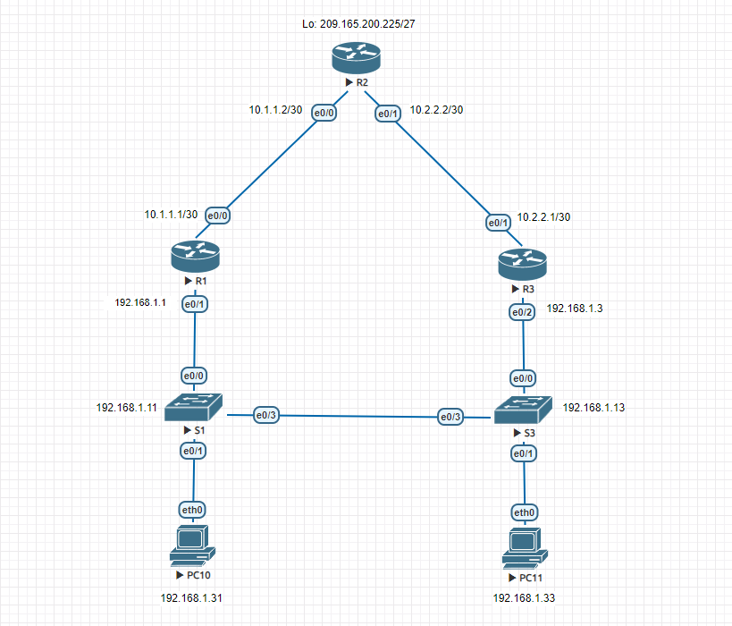

# Лабораторная работа. Настройка протоколов HSRP и GLBP
### Топология

### Таблица адресации
|Устройство|Интерфейс|IP-адрес       |Маска подсети   |Шлюз по умолчанию|
|----------|---------|---------------|----------------|-----------------|
| R1			 | e0/1		 |192.168.1.1    |255.255.255.0   |-                |
|          | e0/0    |10.1.1.1       |255.255.255.252 |-                |
| R2       | e0/0    |10.1.1.2       |255.255.255.252 |-                |
|          | e0/1    |10.2.2.2       |255.255.255.252 |-                |
|          | Lo0     |209.165.200.225|255.255.255.224 |-                |
| R3       | e0/1    |10.2.2.1       |255.255.255.252 |-                |
|          | e0/2    |192.168.1.3    |255.255.255.0   |-                |
| S1       | VLAN 1  |192.168.1.11   |255.255.255.0   |192.168.1.1      |
| S2       | VLAN 1  |192.168.1.13   |255.255.255.0   |192.168.1.3      |
| PC-A     | NIC     |192.168.1.31   |255.255.255.0   |192.168.1.1      |
| PC-B     | NIC     |192.168.1.33   |255.255.255.0   |192.168.1.3      |

### Задачи
Часть 1. Построение сети и проверка соединения
Часть 2. Настройка обеспечения избыточности на первом хопе с помощью HSRP
Часть 3. Настройка обеспечения избыточности на первом хопе с помощью GLBP

### Часть 1: Построение сети и проверка соединения
#### Шаг 1: Подключите кабели в сети в соответствии с топологией.
#### Шаг 2: Настройте узлы ПК.
```
VPCS> ip 192.168.1.31 255.255.255.0 192.168.1.1
VPCS> save
```
```
VPCS : ip 192.168.1.33 255.255.255.0 192.168.1.3
VPCS> save
```
```
#### Шаг 3: Выполните инициализацию и перезагрузку маршрутизатора и коммутаторов.
#### Шаг 4: Настройте базовые параметры каждого маршрутизатора.
Router#conf t
Router(config)#no ip domain lookup
Router(config)#line console 0
Router(config-line)#logging synchronous
Router(config-line)#exit
Router(config)#host R1
R1(config)#int e0/1
R1(config-if)#ip address 192.168.1.1 255.255.255.0
R1(config-if)#no sh
R1(config-if)#ex
R1(config)#int e0/0
R1(config-if)#ip address 10.1.1.1 255.255.255.252
R1(config-if)#no sh
R1#wr
```
```
Router>en
Router#conf t
Router(config)#no ip domain lookup
Router(config)#line console 0
Router(config-line)#logging synchronous
Router(config-line)#exit
Router(config)#host R2
R2(config)#int e0/0
R2(config-if)#ip address 10.1.1.2 255.255.255.252
R2(config-if)#no sh
R2(config-if)#exit
R2(config)#int e0/1
R2(config-if)#ip address 10.2.2.2 255.255.255.252
R2(config-if)#no sh
R2(config)#int l0
R2(config-if)#ip address 209.165.200.225 255.255.255.224
R2(config-if)#no sh
R2(config-if)#end
R2#wr
```
```
Router>en
Router#
Router#conf t
Router(config)#no ip domain lookup
Router(config)#line console 0
Router(config-line)#logging synchronous
Router(config-line)#exit
Router(config)#int e0/1
Router(config-if)#ip address 10.2.2.1 255.255.255.252
Router(config-if)#no sh
Router(config-if)#ex
Router(config)#int e0/2
Router(config-if)#ip address 192.168.1.3 255.255.255.0
Router(config-if)#no sh
Router(config-if)#ex
Router(config)#Host R3
R3(config)#do wr
```
#### Шаг 5: Настройте базовые параметры каждого коммутатора.
```
Switch>en
Switch#conf t
Switch(config)#no ip domain lookup
Switch(config)#line console 0
Switch(config-line)#logging synchronous
Switch(config-line)#int vlan 1
Switch(config-if)#ip address 192.168.1.11 255.255.255.0
Switch(config-if)#ex
Switch(config)#ip default-gateway 192.168.1.1
Switch(config)#
Switch(config)#host S1
S1(config)#do wr
```
```
Switch>en
Switch#conf t
Switch(config)#host S3
S3(config)#no ip domain lookup
S3(config)#line console 0
S3(config-line)#logging synchronous
S3(config-line)#exit
S3(config)#int vlan 1
S3(config-if)#ip address 192.168.1.13 255.255.255.0
S3(config-if)#no sh
S3(config-if)#ex
S3(config)#ip default-gateway 192.168.1.3
S3(config)#do wr
```
#### Шаг 6: Проверьте подключение между PC-A и PC-C.
Отправьте эхо-запрос с компьютера PC-A на компьютер PC-C. Успешно ли выполнен эхо-запрос?


#### Шаг 7: Настройте маршрутизацию.
##### a. Настройте протокол EIGRP на маршрутизаторах и используйте значение административной дистанции, равное 1. Добавьте в процесс EIGRP все сети, кроме 209.165.200.224/27.
```
R3(config)#router eigrp 1
R3(config-router)#network 10.2.2.0 0.0.0.3
R3(config-router)#network 192.168.1.0 0.0.0.255
R3(config-router)#do wr
```
```
R1(config)#router eigrp 1
R1(config-router)#network 10.1.1.0 0.0.0.3
R1(config-router)#network 192.168.1.0 0.0.0.255
R1(config-router)#do wr
```
```
R2#conf t
R2(config)#router eigrp 1
R2(config-router)#network 10.1.1.0 0.0.0.3
R2(config-router)#network 10.1.1.0 0.0.0.3
R2(config-router)#network 10.2.2.0 0.0.0.3
```
#### b. Настройте маршрут по умолчанию на R2, используя Lo1 в качестве выходного интерфейса к сети 209.165.200.224/27, и перераспределите этот маршрут в процесс EIGRP.
```
R2#conf t
R2(config)#ip route 209.165.200.224 255.255.255.224 l0
R2(config)#router eigrp 1
R2(config-router)#redistribute static
```
#### Шаг 8: Проверьте соединение.
##### a. Эхо-запросы, отправленные от PC-A в каждый интерфейс на R1, R2, R3 и PC-C, должны быть успешными. Все эхо-запросы выполнены успешно? 

##### b. Эхо-запросы, отправленные от PC-C в каждый интерфейс на R1, R2, R3 и PC-A., должны быть успешными. Все эхо-запросы выполнены успешно?

### Часть 2: Настройка обеспечения избыточности на первом хопе с помощью HSRP
#### Шаг 1: Определите путь интернет-трафика для PC-A и PC-C.
##### a. В командной строке на PC-A введите команду tracert для loopback-адреса 209.165.200.225 на маршрутизаторе R2

##### b. В командной строке на PC-С введите команду tracert для loopback-адреса 209.165.200.225 на маршрутизаторе R2.

#### Шаг 2: Запустите сеанс эхо-тестирования на PC-A и разорвите соединение между S1 и R1.
##### a. В командной строке на PC-A введите команду ping –t для адреса 209.165.200.225 на маршрутизаторе R2. Убедитесь, что окно командной строки открыто.
##### b. В процессе эхо-тестирования отсоедините кабель Ethernet от интерфейса F0/5 на S1. Отключение интерфейса F0/5 на S1 приведет к тому же результату. Что произошло с трафиком эхо-запросов?


Связь пропала, т.к. шлюз по умолчанию стал недоступен
##### c. Повторите шаги 2a и 2b на PC-C и S3. Отсоедините кабель от интерфейса F0/5 на S3. Какие получены результаты?

Результат аналогичный.
#### Шаг 3: Настройте HSRP на R1 и R3.
В этом шаге вам предстоит настроить HSRP и изменить адрес шлюза по умолчанию на компьютерах PC-A, PC-C, S1 и коммутаторе S2 на виртуальный IP-адрес для HSRP. R1 назначается активным маршрутизатором с помощью команды приоритета HSRP.
##### a. Настройте протокол HSRP на маршрутизаторе R3. 
```R3(config)#
R3(config)#int e0/1
R3(config-if)#standby 1 ip 192.168.1.254
```
##### b. Настройте протокол HSRP на маршрутизаторе R1
```
R1(config)#int e0/1
R1(config-if)#standby 1 ip 192.168.1.254
R1(config-if)#standby 1 priority 150
```
##### c. Проверьте HSRP, выполнив команду show standby на R1 и R3.


R1 стал Standby даже большим приоритетом потому что был включен после R3, который раньше него взял роль Avtive. Чтобы они поменялись ролями (чтобы R1 в соответствии со своим высоким приоритетом стал Active) в реальном времени на R1 нужно ввести команду:

Какой MAC-адрес используется для виртуального IP-адреса? Ответ: 0000.0c07.ac01
Какой IP-адрес и приоритет используются для резервного маршрутизатора? Ответ: 192.168.1.254, приоритет 100

##### d. Используйте команду show standby brief на R1 и R3, чтобы просмотреть сводку состояния HSRP.


##### e. Измените адрес шлюза по умолчанию для PC-A, PC-C, S1 и S3.
```
ip 192.168.1.31 255.255.255.0 192.168.1.254
```
```
ip 192.168.1.33 255.255.255.0 192.168.1.254
```
```
S1>en
S1#conf t
S1(config)#ip default-gateway 192.168.1.254
```
```
S3>en
S3#conf t
S3(config)#ip default-gateway 192.168.1.254
```
#### Шаг 4: Запустите сеанс эхо-тестирования на PC-A и разорвите соединение с коммутатором, подключенным к активному маршрутизатору HSRP (R1).
##### a. В командной строке на PC-A введите команду ping –t для адреса 209.165.200.225 на маршрутизаторе R2. Убедитесь, что окно командной строки открыто.
##### b. Во время отправки эхо-запроса отсоедините кабель Ethernet от интерфейса F0/5 на коммутаторе S1 или выключите интерфейс F0/5. Что произошло с трафиком эхо-запросов?
Трафик не прервался, т.к. R3 оперативно взял на себя роль Active
#### Шаг 5: Проверьте настройки HSRP на маршрутизаторах R1 и R3.
##### a. На коммутаторах R1 и R3 выполните команду show standby brief.


Какой маршрутизатор является активным? Ответ: R3
##### b. Повторно подсоедините кабель, соединяющий коммутатор и маршрутизатор, или включите интерфейс F0/5.
##### c. Отключите команды конфигурации HSRP на маршрутизаторах R1 и R3
```
R1(config)# interface g0/1
R1(config-if)# no standby 1
```
```
R3(config)# interface g0/1
R3(config-if)# no standby 1
```
Часть 3: Настройка обеспечения избыточности на первом хопе с помощью GLBP
