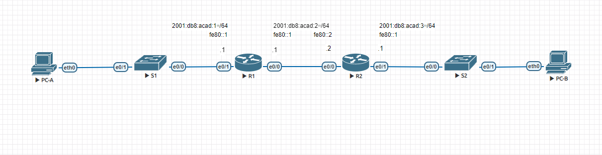
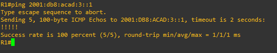
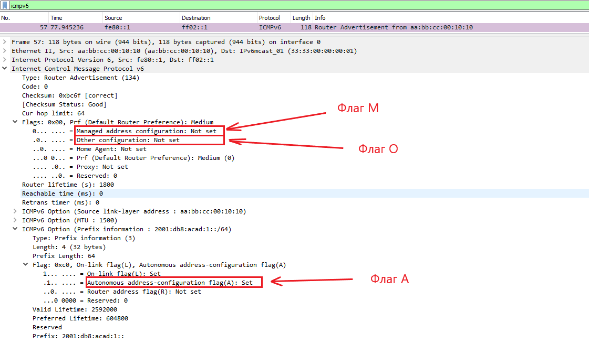
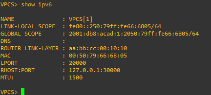
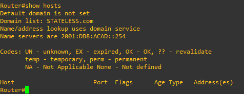
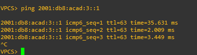
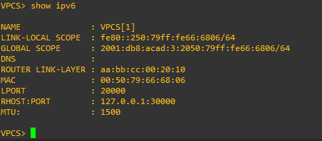
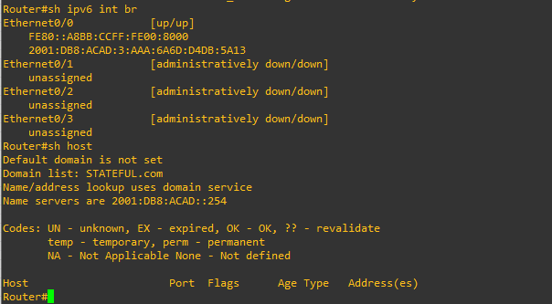
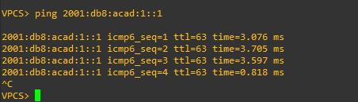

# Лабраторная работа 3. Настройка DHCPv6 
### Топология

### Таблица адресации

|Устройство|Интерфейс |IPv6-адрес            |
|----------|----------|----------------------|
| R1			 | e0/0		  |2001:db8:acad:2።1/64  |
|          |          |fe80::1               |
|          | e0/1     |2001:db8:acad:1።1/64  |
|          |          |fe80::1               |
| R2       | e0/0     |2001:db8:acad:2።2/64  |
|          |          |fe80::2               |
|          | e0/1     |2001:db8:acad:3።1/64  |
|          |          |fe80::1               |
| PC-A     | NIC      |DHCP                  |
| PC-B     | NIC      |DHCP                  |

### Задачи
1. Создание сети и настройка основных параметров устройства 
2. Проверка назначения адреса SLAAC от R1 
3. Настройка и проверка сервера DHCPv6 без отслеживания состояния на R1 
4. Настройка и проверка сервера DHCPv6 с отслеживанием состояния на R1 
5. Настройка и проверка DHCPv6 Relay на R2

### Часть 1. Создание сети и настройка основных параметров устройства
#### Шаг 1. Создайте сеть согласно топологии. 
#### Шаг 2. Настройте базовые параметры каждого коммутатора (необязательно)
#### Шаг 3. Произведите базовую настройку маршрутизаторов. 
```
Router>en
Router#conf t
Router(config)#ipv6 unicast-routing
Router(config)#no ip domain lookup
Router(config)#line console 0
Router(config-line)#logging synchronous
Router(config-line)#exit
Router(config)#host R1
R1(config)#do wr
```
```
Router#
Router#conf t
Router(config)#ipv6 unicast-routing
Router(config)#no ip domain lookup
Router(config)#line console 0
Router(config-line)#logging synchronous
Router(config-line)#exit
Router(config)#host R2
R2(config)#do wr
```
#### Шаг 4. Настройка интерфейсов и маршрутизации для обоих маршрутизаторов. 
##### a. Настройте интерфейсы e0/0 и e0/1 на R1 и R2 с адресами IPv6, указанными в таблице выше. 
```
R1#
R1#conf t
R1(config)#int e0/1
R1(config-if)#ipv6 address 2001:db8:acad:1::1/64
R1(config-if)#no sh
R1(config-if)#ipv6 address fe80::1 link-local
R1(config-if)#ex
R1(config)#int e0/0
R1(config-if)#ipv6 address 2001:db8:acad:2::1/64
R1(config-if)#no sh
R1(config-if)#ipv6 address fe80::1 link-local
R1(config-if)#do wr
```
```
R2>en
R2#
R2#conf t
R2(config)#int e0/0
R2(config-if)#ipv6 address 2001:db8:acad:2::2/64
R2(config-if)#no sh
R2(config-if)#ipv6 address fe80::2 link-local
R2(config-if)#ex
R2(config)#int e0/1
R2(config-if)#ipv6 address 2001:db8:acad:3::1/64
R2(config-if)#no sh
R2(config-if)#ipv6 address fe80::1 link-local
R2(config-if)#do wr
```
##### b. Настройте маршрут по умолчанию на каждом маршрутизаторе, который указывает на IP-адрес e0/0 на другом маршрутизаторе. 
```
R1#
R1#conf t
R1(config)#ipv6 route ::/0 2001:db8:acad:2::2
```
```
R2#
R2#conf t
R2(config)#ipv6 route ::/0 2001:db8:acad:2::1
```
##### c. Убедитесь, что маршрутизация работает с помощью пинга адреса e0/1 R2 из R1 

##### d. Сохраните текущую конфигурацию в файл загрузочной конфигурации. 
```
R1#wr
```
```
R2#wr
```
### Часть 2. Проверка назначения адреса SLAAC от R1
После ввода команды ```ipv6 unicast routing``` на маршрутизаторе по умолчанию назначение GUA (Global Unique Address) осуществляется способом SLAAC. Этим способом устройство посредством сообщения от роутера ICMPv6 Router Advertisement (RA) получает от него префикс и длину префикса сети. Далее устройство будет генерировать оставшуюся 64-битную часть IPv6 адреса через алгоритм EUI-64 или случайным образом. Посмотрим на сообщение RA:



Теперь проверим, что PC-A получил префикс от роутера и сгенерировал себе вторую часть адреса:



### Часть 3. Настройка и проверка сервера DHCPv6 на R1
#### Шаг 1. Более подробно изучите конфигурацию PC-A. 
##### a. Выполните команду show ipv6 на PC-A и посмотрите на результат. 

##### b. Обратите внимание, что основной DNS-суффикс отсутствует.
#### Шаг 2. Настройте R1 для предоставления DHCPv6 без состояния для PC-A.
##### a. Создайте пул DHCP IPv6 на R1 с именем R1-STATELESS. В составе этого пула назначьте адрес DNS-сервера как 2001:db8:acad: :1, а имя домена — как stateless.com. 
```
R1>en
R1#conf t
R1(config)#ipv6 dhcp pool R1-STATELESS
R1(config-dhcpv6)#dns-server 2001:db8:acad::254
R1(config-dhcpv6)#domain-name STATELESS.com
```
b. Настройте интерфейс e0/1 на R1, чтобы предоставить флаг конфигурации OTHER для локальной сети R1 и укажите только что созданный пул DHCP в качестве ресурса DHCP для этого интерфейса. 
```
R1#conf t
R1(config)#int e0/1
R1(config-if)#ipv6 nd other-config-flag
R1(config-if)#ipv6 dhcp server R1-STATELESS
```
##### c. Сохраните текущую конфигурацию в файл загрузочной конфигурации.
```
R1#wr
```
##### d. Перезапустите PC-A. 
##### e. Проверьте вывод show ipv6 и обратите внимание на изменения. 
Так как с у VPS проблемы с получением IPv6 адресом DNS сервера я подключил роутер как клиент и получил доп параметры:



##### f. Тестирование подключения с помощью пинга IP-адреса интерфейса e0/1 R2.


### Часть 4. Настройка сервера DHCPv6 с сохранением состояния на R1
##### a. Создайте пул DHCPv6 на R1 для сети 2001:db8:acad:3:aaa::/80. Это предоставит адреса локальной сети, подключенной к интерфейсу e0/1 на R2. В составе пула задайте DNS-сервер 2001:db8:acad: :254 и задайте доменное имя STATEFUL.com. 
```
R1>en
R1#
R1#conf t
R1(config)#ipv6 dhcp pool R2-STATEFUL
R1(config-dhcpv6)#address prefix 2001:db8:acad:3:aaa::/80
R1(config-dhcpv6)#dns-server 2001:db8:acad::254
R1(config-dhcpv6)#domain-name STATEFUL.com
```
##### b. Назначьте только что созданный пул DHCPv6 интерфейсу e0/0 на R1. 
```
R1#
R1#conf t
R1(config)#int e0/0
R1(config-if)#ipv6 dhcp server R2-STATEFUL
```
### Часть 5. Настройка и проверка ретрансляции DHCPv6 на R2.
#### Шаг 1. Включите PC-B и проверьте адрес SLAAC, который он генерирует. 

#### Шаг 2. Настройте R2 в качестве агента DHCP-ретрансляции для локальной сети на e0/1. 
##### a. Настройте команду ipv6 dhcp relay на интерфейсе R2 e0/1, указав адрес назначения интерфейса e0/0 на R1. Также настройте команду managed-config-flag . 
```
R2>en
R2#conf t
R2(config)#int e0/1
R2(config-if)#ipv6 nd managed-config-flag
R2(config-if)#ipv6 dhcp relay destination 2001:db8:acad:2::1 e0/0
```
##### b. Сохраните конфигурацию.
```
R2#wr
```
#### Шаг 3. Попытка получить адрес IPv6 из DHCPv6 на PC-B.
##### a. Перезапустите PC-B. 
##### b. Откройте командную строку на PC-B и выполните команду show ipv6 и проверьте выходные данные, чтобы увидеть результаты операции ретрансляции DHCPv6. 
Снова подключим роутер в качестве клиента и проверим:



##### c. Проверьте подключение с помощью пинга IP-адреса интерфейса R1 e0/1.

