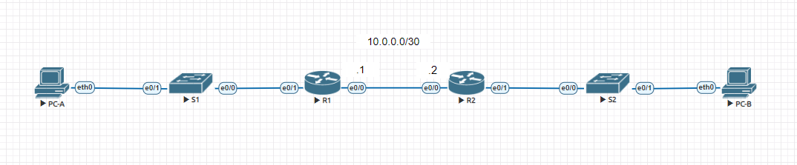
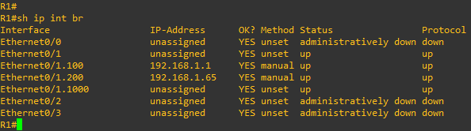

# Лабораторная работа 3. Реализация DHCPv4
### Топология

### Таблица адресации

|Устройство|Интерфейс |IP-адрес       |Маска подсети   |Шлюз по умолчанию|
|----------|----------|---------------|----------------|-----------------|
| R1			 | e0/1		  |-              |-               |-                |
|          | e0/1.100 |192.168.1.1    |255.255.255.192 |-                |
|          | e0/1.200 |192.168.1.65   |255.255.255.224 |-                |
|          | e0/1.1000|-              |-               |-                |
|          | e0/0     |10.0.0.1       |255.255.255.252 |-                |
| R2       | e0/0     |10.0.0.2       |255.255.255.252 |-                |
|          | e0/1     |192.168.1.97   |255.255.255.240 |-                |
| S1       | VLAN 200 |192.168.1.2    |255.255.255.192 |192.168.1.1      |
| S2       | VLAN 1   |192.168.1.98   |255.255.255.224 |192.168.1.97     |
| PC-A     | NIC      |DHCP           |DHCP            |DHCP             |
| PC-B     | NIC      |DHCP           |DHCP            |DHCP             |

### Таблица VLAN

|VLAN      |Имя           |Назначенный интерфейс           |
|----------|--------------|--------------------------------|
|1  			 |default		    |S2: e0/1                        |
|100       |clients       |S1: e0/1                        |
|200       |Management    |S1: VLAN 200                    |
|999       |Parking_Lot   |S1: e0/2-e0/3                   |
|1000      |Native        |-                               |

### Задачи 
Часть 1. Создание сети и настройка основных параметров устройства 
Часть 2. Настройка и проверка двух серверов DHCPv4 на R1 
Часть 3. Настройка и проверка DHCP-ретрансляции на R2 

### Часть 1. Создание сети и настройка основных параметров устройства
#### Шаг 1. Создание схемы адресации 
Подсеть сети 192.168.1.0/24 в соответствии со следующими требованиями:
##### a. Одна подсеть «Подсеть A», поддерживающая 58 хостов (клиентская VLAN на R1). 
Выберем подсеть с префиксом /26, включающую в себя 64 адреса - 192.168.1.0/26. 
##### b. Одна подсеть «Подсеть B», поддерживающая 28 хостов (управляющая VLAN на R1).  
Выберем подсеть с префиксом /27, включающую в себя 32 адреса - 192.168.1.64/27. 
##### c. Одна подсеть «Подсеть C», поддерживающая 12 узлов (клиентская сеть на R2). 
Выберем подсеть с префиксом /28, включающую в себя 16 адресов - 192.168.1.96/28. 
#### Шаг 2. Создайте сеть согласно топологии. 
####Шаг 3. Произведите базовую настройку маршрутизаторов.
```
Router>en
Router#conf t
Router(config)#host R1
R1(config)#no ip domain lookup
R1(config)#line console 0
R1(config-line)#logging synchronous
R1(config-line)#do wr
```
```
Router>
Router>en
Router#conf t
Router(config)#host R2
R2(config)#no ip domain lookup
R2(config)#line console 0
R2(config-line)#logging synchronous
R2(config-line)#do wr
```
#### Шаг 4. Настройка маршрутизации между сетями VLAN на маршрутизаторе R1 
##### a. Активируйте интерфейс G0/0/1 на маршрутизаторе. 
```
R1>en
R1#conf t
R1(config)#int e0/1
R1(config-if)#no sh
```
##### b. Настройте подинтерфейсы для каждой VLAN в соответствии с требованиями таблицы IP адресации. Все субинтерфейсы используют инкапсуляцию 802.1Q и назначаются первый полезный адрес из вычисленного пула IP-адресов. Убедитесь, что подинтерфейсу для native VLAN не назначен IP-адрес. Включите описание для каждого подинтерфейса. 
```
R1#
R1#conf t
R1(config)#int e0/1.100
R1(config-subif)#encapsulation dot1Q 100
R1(config-subif)#description VLAN 100
R1(config-subif)#ip address 192.168.1.1 255.255.255.192
R1(config-subif)#no sh
R1(config-subif)#exit
R1(config)#int e0/1.200
R1(config-subif)#encapsulation dot1Q 200
R1(config-subif)#description VLAN 200
R1(config-subif)#ip address 192.168.1.65 255.255.255.224
R1(config-subif)#no sh
R1(config-subif)#exit
R1(config)#int e0/1.1000
R1(config-subif)#description native VLAN
R1(config-subif)#no sh
```
##### c. Убедитесь, что подинтерфейсы работают.

#### Шаг 5. Настройте e0/1 на R2, затем e0/0 и статическую маршрутизацию для обоих маршрутизаторов
##### a. Настройте e0/1 на R2 с первым IP-адресом подсети C, рассчитанным ранее. 
```
R2>en
R2#conf t
R2(config)#int e0/1
R2(config-if)#ip address 192.168.1.97 255.255.255.240
R2(config-if)#no sh
```
##### b. Настройте интерфейс e0/0 для каждого маршрутизатора на основе приведенной выше таблицы IP-адресации. 
```
R2#conf t
R2(config)#int e0/0
R2(config-if)#ip address 10.0.0.2 255.255.255.252
R2(config-if)#no sh
```
```
R1#conf t
R1(config)#int e0/0
R1(config-if)#ip address 10.0.0.1 255.255.255.252
R1(config-if)#no sh
```
##### c. Настройте маршрут по умолчанию на каждом маршрутизаторе, указываемом на IP-адрес e0/0 на другом маршрутизаторе. 
```
R1#conf t
R1(config)#ip route 0.0.0.0 0.0.0.0 10.0.0.2
```
```
R2#conf t
R2(config)#ip route 0.0.0.0 0.0.0.0 10.0.0.1
```
##### d. Убедитесь, что статическая маршрутизация работает с помощью пинга до адреса e0/1 R2 от R1. 
```
R1#ping 192.168.1.97
Type escape sequence to abort.
Sending 5, 100-byte ICMP Echos to 192.168.1.97, timeout is 2 seconds:
!!!!!
Success rate is 100 percent (5/5), round-trip min/avg/max = 1/1/1 ms
```
##### e. Сохраните текущую конфигурацию в файл загрузочной конфигурации.
```
R1#wr
```
```
R2#wr
```
