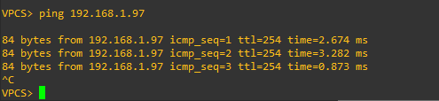

# Лабораторная работа 3. Реализация DHCPv4
### Топология

### Таблица адресации

|Устройство|Интерфейс |IP-адрес       |Маска подсети   |Шлюз по умолчанию|
|----------|----------|---------------|----------------|-----------------|
| R1			 | e0/1		  |-              |-               |-                |
|          | e0/1.100 |192.168.1.1    |255.255.255.192 |-                |
|          | e0/1.200 |192.168.1.65   |255.255.255.224 |-                |
|          | e0/1.1000|-              |-               |-                |
|          | e0/0     |10.0.0.1       |255.255.255.252 |-                |
| R2       | e0/0     |10.0.0.2       |255.255.255.252 |-                |
|          | e0/1     |192.168.1.97   |255.255.255.240 |-                |
| S1       | VLAN 200 |192.168.1.2    |255.255.255.192 |192.168.1.1      |
| S2       | VLAN 1   |192.168.1.98   |255.255.255.224 |192.168.1.97     |
| PC-A     | NIC      |DHCP           |DHCP            |DHCP             |
| PC-B     | NIC      |DHCP           |DHCP            |DHCP             |

### Таблица VLAN

|VLAN      |Имя           |Назначенный интерфейс           |
|----------|--------------|--------------------------------|
|1  			 |default		    |S2: e0/1                        |
|100       |clients       |S1: e0/1                        |
|200       |Management    |S1: VLAN 200                    |
|999       |Parking_Lot   |S1: e0/2-e0/3                   |
|1000      |Native        |-                               |

### Задачи 
Часть 1. Создание сети и настройка основных параметров устройства 
Часть 2. Настройка и проверка двух серверов DHCPv4 на R1 
Часть 3. Настройка и проверка DHCP-ретрансляции на R2 

### Часть 1. Создание сети и настройка основных параметров устройства
#### Шаг 1. Создание схемы адресации 
Подсеть сети 192.168.1.0/24 в соответствии со следующими требованиями:
##### a. Одна подсеть «Подсеть A», поддерживающая 58 хостов (клиентская VLAN на R1). 
Выберем подсеть с префиксом /26, включающую в себя 64 адреса - 192.168.1.0/26. 
##### b. Одна подсеть «Подсеть B», поддерживающая 28 хостов (управляющая VLAN на R1).  
Выберем подсеть с префиксом /27, включающую в себя 32 адреса - 192.168.1.64/27. 
##### c. Одна подсеть «Подсеть C», поддерживающая 12 узлов (клиентская сеть на R2). 
Выберем подсеть с префиксом /28, включающую в себя 16 адресов - 192.168.1.96/28. 
#### Шаг 2. Создайте сеть согласно топологии. 
####Шаг 3. Произведите базовую настройку маршрутизаторов.
```
Router>en
Router#conf t
Router(config)#host R1
R1(config)#no ip domain lookup
R1(config)#line console 0
R1(config-line)#logging synchronous
R1(config-line)#do wr
```
```
Router>
Router>en
Router#conf t
Router(config)#host R2
R2(config)#no ip domain lookup
R2(config)#line console 0
R2(config-line)#logging synchronous
R2(config-line)#do wr
```
#### Шаг 4. Настройка маршрутизации между сетями VLAN на маршрутизаторе R1 
##### a. Активируйте интерфейс G0/0/1 на маршрутизаторе. 
```
R1>en
R1#conf t
R1(config)#int e0/1
R1(config-if)#no sh
```
##### b. Настройте подинтерфейсы для каждой VLAN в соответствии с требованиями таблицы IP адресации. Все субинтерфейсы используют инкапсуляцию 802.1Q и назначаются первый полезный адрес из вычисленного пула IP-адресов. Убедитесь, что подинтерфейсу для native VLAN не назначен IP-адрес. Включите описание для каждого подинтерфейса. 
```
R1#
R1#conf t
R1(config)#int e0/1.100
R1(config-subif)#encapsulation dot1Q 100
R1(config-subif)#description VLAN 100
R1(config-subif)#ip address 192.168.1.1 255.255.255.192
R1(config-subif)#no sh
R1(config-subif)#exit
R1(config)#int e0/1.200
R1(config-subif)#encapsulation dot1Q 200
R1(config-subif)#description VLAN 200
R1(config-subif)#ip address 192.168.1.65 255.255.255.224
R1(config-subif)#no sh
R1(config-subif)#exit
R1(config)#int e0/1.1000
R1(config-subif)#description native VLAN
R1(config-subif)#no sh
```
##### c. Убедитесь, что подинтерфейсы работают.

#### Шаг 5. Настройте e0/1 на R2, затем e0/0 и статическую маршрутизацию для обоих маршрутизаторов
##### a. Настройте e0/1 на R2 с первым IP-адресом подсети C, рассчитанным ранее. 
```
R2>en
R2#conf t
R2(config)#int e0/1
R2(config-if)#ip address 192.168.1.97 255.255.255.240
R2(config-if)#no sh
```
##### b. Настройте интерфейс e0/0 для каждого маршрутизатора на основе приведенной выше таблицы IP-адресации. 
```
R2#conf t
R2(config)#int e0/0
R2(config-if)#ip address 10.0.0.2 255.255.255.252
R2(config-if)#no sh
```
```
R1#conf t
R1(config)#int e0/0
R1(config-if)#ip address 10.0.0.1 255.255.255.252
R1(config-if)#no sh
```
##### c. Настройте маршрут по умолчанию на каждом маршрутизаторе, указываемом на IP-адрес e0/0 на другом маршрутизаторе. 
```
R1#conf t
R1(config)#ip route 0.0.0.0 0.0.0.0 10.0.0.2
```
```
R2#conf t
R2(config)#ip route 0.0.0.0 0.0.0.0 10.0.0.1
```
##### d. Убедитесь, что статическая маршрутизация работает с помощью пинга до адреса e0/1 R2 от R1. 
```
R1#ping 192.168.1.97
Type escape sequence to abort.
Sending 5, 100-byte ICMP Echos to 192.168.1.97, timeout is 2 seconds:
!!!!!
Success rate is 100 percent (5/5), round-trip min/avg/max = 1/1/1 ms
```
##### e. Сохраните текущую конфигурацию в файл загрузочной конфигурации.
```
R1#wr
```
```
R2#wr
```
#### Шаг 6. Настройте базовые параметры каждого коммутатора. 
```
Switch>en
Switch#conf t
Switch(config)#host S1
S1(config)#no ip domain lookup
S1(config)#line console 0
S1(config-line)#logging synchronous
S1(config-line)#do wr
```
```
Switch>en
Switch#conf t
Switch(config)#host S2
S2(config)#no ip domain lookup
S2(config)#line console 0
S2(config-line)#logging synchronous
S2(config-line)#do wr
```
#### Шаг 7. Создайте сети VLAN на коммутаторе S1.
##### a. Создайте необходимые VLAN на коммутаторе 1 и присвойте им имена из приведенной выше таблицы.
```
S1>en
S1#conf t
S1(config)#vlan 100
S1(config-vlan)#name Clients
S1(config-vlan)#ex
S1(config)#vlan 200
S1(config-vlan)#name Management
S1(config-vlan)#ex
S1(config)#vlan 999
S1(config-vlan)#name Parking_Lot
S1(config-vlan)#ex
S1(config)#vlan 1000
S1(config-vlan)#name Native
```
##### b. Настройте и активируйте интерфейс управления на S1 (VLAN 200), используя второй IP-адрес из подсети, рассчитанный ранее. Кроме того установите шлюз по умолчанию на S1. 
```
S1>
S1>en
S1#conf t
S1(config)#int vlan 200
S1(config-if)#ip address 192.168.1.2 255.255.255.192
S1(config-if)#no sh
S1(config-if)#ex
S1(config)#ip default-gateway 192.168.1.1
```
##### c. Настройте и активируйте интерфейс управления на S2 (VLAN 1), используя второй IP-адрес из подсети, рассчитанный ранее. Кроме того, установите шлюз по умолчанию на S2
```
S2>en
S2#conf t
S2(config)#int vlan 1
S2(config-if)#ip address 192.168.1.98 255.255.255.224
S2(config-if)#no sh
S2(config-if)#ex
S2(config)#ip default-gateway 192.168.1.97
```
##### d. Назначьте все неиспользуемые порты S1 VLAN Parking_Lot, настройте их для статического режима доступа и административно деактивируйте их. На S2 административно деактивируйте все неиспользуемые порты. 
```
S1#
S1#conf t
S1(config)#int range e0/2-3
S1(config-if-range)#switchport mode access
S1(config-if-range)#switchport access vlan 999
S1(config-if-range)#sh
```
```
S2#
S2#conf t
S2(config)#int range e0/2-3
S2(config-if-range)#sh
```
#### Шаг 8. Назначьте сети VLAN соответствующим интерфейсам коммутатора.
##### a. Назначьте используемые порты соответствующей VLAN (указанной в таблице VLAN выше) и настройте их для режима статического доступа. 
```
S1#
S1#conf t
S1(config)#int e0/1
S1(config-if)#switchport mode access
S1(config-if)#switchport access vlan 100
```
##### b. Убедитесь, что VLAN назначены на правильные интерфейсы.


Почему интерфейс F0/5 указан в VLAN 1? Потому, что в условии задания не было задачи в его конфигурации. А также потому что он еще не сконфигурирован как транк.
#### Шаг 9. Вручную настройте интерфейс S1 F0/5 в качестве транка 802.1Q. 
##### a. Измените режим порта коммутатора, чтобы принудительно создать магистральный канал. 
```
S1#conf t
S1(config)#int e0/0
S1(config-if)#switchport trunk encapsulation dot1q
S1(config-if)#switchport mode trunk
```
##### b. В рамках конфигурации транка  установите для native  VLAN значение 1000. 
```
S1(config-if)#switchport trunk native vlan 1000
```
##### c. В качестве другой части конфигурации магистрали укажите, что VLAN 100, 200 и 1000 могут проходить по транку. 
```
S1(config-if)#switchport trunk allowed vlan 100,200,1000
```
##### d. Сохраните текущую конфигурацию в файл загрузочной конфигурации.
```
S1#wr
```
##### e. Проверьте состояние транка.

### Часть 2. Настройка и проверка двух серверов DHCPv4 на R1
#### Шаг 1. Настройте R1 с пулами DHCPv4 для двух поддерживаемых подсетей. 
```
R1#
R1#conf t
R1(config)#ip dhcp excluded-address 192.168.1.1 192.168.1.5
R1(config)#ip dhcp pool Subnet_A
R1(dhcp-config)#network 192.168.1.0 255.255.255.192
R1(dhcp-config)#domain-name CCNA-lab.com
R1(dhcp-config)#default-router 192.168.1.1
R1(dhcp-config)#lease 2 12 30
```
```
R1#
R1#conf t
R1(config)#ip dhcp excluded-address 192.168.1.97 192.168.1.102
R1(config)#ip dhcp pool R2_Client_LAN
R1(dhcp-config)#network 192.168.1.96 255.255.255.240
R1(dhcp-config)#domain-name CCNA-lab.com
R1(dhcp-config)#default-router 192.168.1.97
R1(dhcp-config)#lease 2 12 30
```
#### Шаг 2. Сохраните конфигурацию.
```
R1#wr
```
#### Шаг 3. Проверка конфигурации сервера DHCPv4
##### a. Чтобы просмотреть сведения о пуле, выполните команду show ip dhcp pool. 

##### b. Выполните команду show ip dhcp bindings для проверки установленных назначений адресов DHCP. 

##### c. Выполните команду show ip dhcp server statistics для проверки сообщений DHCP. 

#### Шаг 4. Попытка получить IP-адрес от DHCP на PC-A
##### a. Из командной строки компьютера PC-A выполните команду dhcp. 
##### b. После завершения процесса обновления выполните команду show ip для просмотра новой информации об IP-адресе. 

##### c. Проверьте подключение с помощью пинга IP-адреса интерфейса R2 e0/1. 

### Часть 3. Настройка и проверка DHCP-ретрансляции на R2
#### Шаг 1. Настройка R2 в качестве агента DHCP-ретрансляции для локальной сети на e0/1 
##### a. Настройте команду ip helper-address на e0/1, указав IP-адрес e0/0 R1. 
```
R2>en
R2#conf t
R2(config)#int e0/1
R2(config-if)#ip helper-address 10.0.0.1
```
##### b. Сохраните конфигурацию. 
```
R2#wr
```
#### Шаг 2. Попытка получить IP-адрес от DHCP на PC-B
a. Из командной строки компьютера PC-B выполните команду dhcp. 
b. После завершения процесса обновления выполните команду show ip для просмотра новой информации об IP-адресе.

c. Проверьте подключение с помощью пинга IP-адреса интерфейса R1 e0/1.

d. Выполните show ip dhcp binding для R1 для проверки назначений адресов в DHCP. 

e. Выполните команду show ip dhcp server statistics для проверки сообщений DHCP. 

