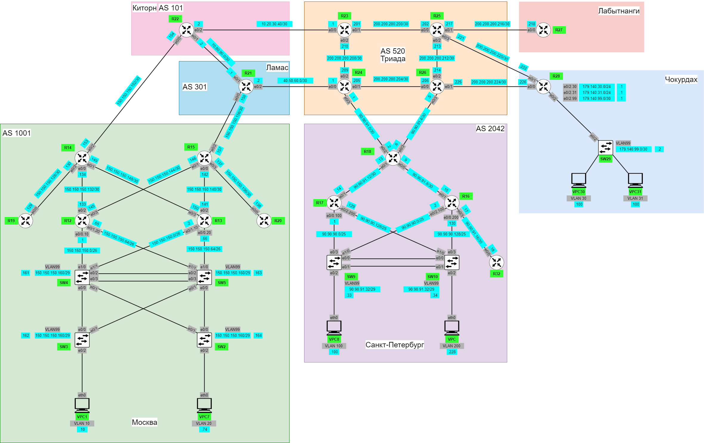

# Лабораторная работа 4. Проектирование сети
### Цель: В данной самостоятельной работе необходимо распланировать адресное пространство. Настроить IP на всех активных портах для дальнейшей работы над проектом. Адресное пространство должно быть задокументировано.

### Схема сети


Для сети в ```Москве``` за основу была взята сеть 150.150.150.0/24:
1. Пользовательская сеть (VLAN 10) - 150.150.150.0/26
2. Пользовательская сеть (VLAN 20) - 150.150.150.64/26
3. Сеть для маршрутизаторов - 150.150.150.128/27
4. Сеть управления (VLAN 99) - 150.150.150.160/29

Для сети в ```Санкт-Петербурге``` - 90.90.90.0/23:
1. 1. Пользовательская сеть (VLAN 10) - 90.90.90.0/25
2. Пользовательская сеть (VLAN 20) - 90.90.90.128/25
3. Сеть для маршрутизаторов - 90.90.91.0/27
4. Сеть управления (VLAN 99) - 90.90.91.32/29

Для сети в ```Триаде``` - 200.200.200.200/26  

Для сети в ```Чокурдах``` - 179.140.223.0/24

Таблицы адресаций для каждой области приведены ниже:
### Триада
|Имя  |Интерфейс    |IP-адрес        |Маска сети        |Соседнее устройство|
|------|-------------|------------------|------------------|-------------------------|
|R23   |E0/1           |200.200.200.201 |255.255.255.252|R25                              |
|         |E0/2           |200.200.200.210 |255.255.255.252|R24                              |
|         |E0/0           |10.20.30.1           |255.255.255.252|R22                              |
|R24   |E0/2           |200.200.200.209 |255.255.255.252|R23                              |
|         |E0/1           |200.200.200.205 |255.255.255.252|R26                              |
|         |E0/3           |90.90.91.1           |255.255.255.252|R18                              |
|         |E0/0           |40.50.60.1           |255.255.255.252|R21                              |
|R25   |E0/0           |200.200.200.202 |255.255.255.252|R23                              |
|         |E0/2           |200.200.200.213 |255.255.255.252|R26                              |
|         |E0/1           |200.200.200.217 |255.255.255.252|R27                              |
|         |E0/3           |200.200.200.221 |255.255.255.252|R28                              |
|R26   |E0/0           |200.200.200.206 |255.255.255.252|R24                              |
|         |E0/2           |200.200.200.214 |255.255.255.252|R25                              |
|         |E0/1           |200.200.200.225 |255.255.255.252|R28                              |
|         |E0/3           |90.90.91.5           |255.255.255.252|R18                              |

### Киторн
|Имя  |Интерфейс    |IP-адрес        |Маска сети        |Соседнее устройство|
|------|-------------|------------------|------------------|-------------------------|
|R22   |E0/2           |10.20.30.2          |255.255.255.252|R23                              |
|         |E0/1           |70.80.90.1          |255.255.255.252|R21                              |
|         |E0/0           |150.150.150.154|255.255.255.252|R14                              |

### Ламас
|Имя  |Интерфейс    |IP-адрес        |Маска сети        |Соседнее устройство|
|------|-------------|------------------|------------------|-------------------------|
|R21   |E0/2           |40.50.60.2          |255.255.255.252|R24                             |
|         |E0/1           |70.80.90.2          |255.255.255.252|R22                              |
|         |E0/0           |150.150.150.158|255.255.255.252|R15                              |

### Лабытнанги
|Имя  |Интерфейс    |IP-адрес        |Маска сети        |Соседнее устройство|
|------|-------------|------------------|------------------|-------------------------|
|R27   |E0/0           |200.200.200.218|255.255.255.252|R25                             |

### Чокурдах
|Имя  |Интерфейс    |IP-адрес        |Маска сети        |Соседнее устройство|
|------|-------------|------------------|------------------|-------------------------|
|R28   |E0/1           |200.200.200.222|255.255.255.252|R25                               |
|      |E0/0           |200.200.200.226|255.255.255.252|R26                               |
|      |E0/2.30         |179.140.30.1    |255.255.255.0    |SW29                           |
|      |E0/2.31         |179.140.31.1    |255.255.255.0    |SW29                           |
|      |E0/2.99         |179.140.99.1    |255.255.255.0    |SW29                           |
|SW29  |VLAN99         |179.140.99.2     |255.255.255.0    |     |
|VPC30 |eth0          |179.140.223.100|255.255.255.0   |SW29                           |
|VPC31 |eth0          |179.140.223.101|255.255.255.0   |SW29                           |

### Москва
|Имя  |Интерфейс    |IP-адрес        |Маска сети        |Соседнее устройство|
|------|-------------|------------------|------------------|-------------------------|
|R14   |E0/2           |150.150.150.153|255.255.255.252|R22                               |
|         |E0/3           |150.150.150.130|255.255.255.252|R19                               |
|         |E0/0           |150.150.150.134|255.255.255.252|R12                               |
|         |E0/1           |150.150.150.149|255.255.255.252|R13                               |
|R15   |E0/2           |150.150.150.157|255.255.255.252|R21                               |
|         |E0/3           |150.150.150.137|255.255.255.252|R20                               |
|         |E0/0           |150.150.150.142|255.255.255.252|R13                               |
|         |E0/1           |150.150.150.146|255.255.255.252|R12                               |
|R19   |E0/0           |150.150.150.129|255.255.255.252|R14                               |
|R20   |E0/0           |150.150.150.138|255.255.255.252|R15                               |
|R12   |E0/2           |150.150.150.133|255.255.255.252|R14                               |
|         |E0/3           |150.150.150.145|255.255.255.252|R15                               |
|         |E0/0.10      |150.150.150.1    |255.255.255.196|SW4                              |
|         |E0/1.20      |150.150.150.65  |255.255.255.196|SW5                               |
|R13   |E0/2           |150.150.150.141|255.255.255.252|R15                               |
|         |E0/3           |150.150.150.150|255.255.255.252|R14                               |
|         |E0/0.20      |150.150.150.66  |255.255.255.196|SW5                              |
|         |E0/1.10      |150.150.150.2    |255.255.255.196|SW4                               |
|SW4  |VLAN99    |150.150.150.161|255.255.255.248|   |
|SW5  |VLAN99    |150.150.150.163|255.255.255.248|   |
|SW3  |VLAN99    |150.150.150.162|255.255.255.248|   |
|SW2  |VLAN99    |150.150.150.164|255.255.255.248|   |
|VPC1 |eth0          |150.150.150.10  |255.255.255.196|SW3                                  |
|VPC7 |eth0          |150.150.150.74  |255.255.255.196|SW2                                  |

### Санкт-Петербург
|Имя  |Интерфейс    |IP-адрес        |Маска сети        |Соседнее устройство|
|------|-------------|------------------|------------------|-------------------------|
|R18   |E0/1           |90.90.91.13        |255.255.255.252|R17                               |
|         |E0/0           |90.90.91.9        |255.255.255.252|R16                               |
|         |E0/2           |90.90.91.2          |255.255.255.0    |R24                           |
|         |E0/3           |90.90.91.6          |255.255.255.0    |R26                           |
|R17   |E0/1           |90.90.91.14        |255.255.255.252|R18                               |
|         |E0/0.10      |90.90.90.1          |255.255.255.128|SW9                               |
|         |E0/2.20      |90.90.90.129      |255.255.255.128|SW10                           |
|R16   |E0/1           |90.90.91.10        |255.255.255.252|R18                               |
|         |E0/3           |90.90.91.17        |255.255.255.252|R32                           |
|         |E0/0.10      |90.90.90.130      |255.255.255.252|SW10                              |
|         |E0/2.20      |90.90.90.2          |255.255.255.0    |SW9                            |
|R32   |E0/0           |90.90.91.18        |255.255.255.252|R16                               |
|SW9  |VLAN99    |90.90.91.33        |255.255.255.248|   |
|SW10|VLAN99    |90.90.91.34        |255.255.255.248|   |
|VPC8 |eth0          |90.90.90.10        |255.255.255.128|SW9                                  |
|VPC   |eth0          |90.90.90.138      |255.255.255.128|SW10                                  |

Пример настройки IP-адресов на маршрутизаторах:
```
R27(config)#int e0/0
R27(config-if)#ip address 200.200.200.218 255.255.255.252
R27(config-if)#no sh
```
Пример настройки IP-адресов на коммутаторах:
```
S29#
S29#conf t
S29(config)#int vlan 99
S29(config-if)#ip address 179.140.223.2 255.255.255.0
S29(config-if)#no sh
```
Пример настройки IP-адресов на клиентах:
```
VPCS> ip 90.90.90.10 255.255.255.128 90.90.90.1

```
Остальные устройства настраиваются по аналогии.
