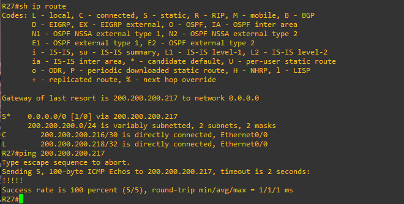
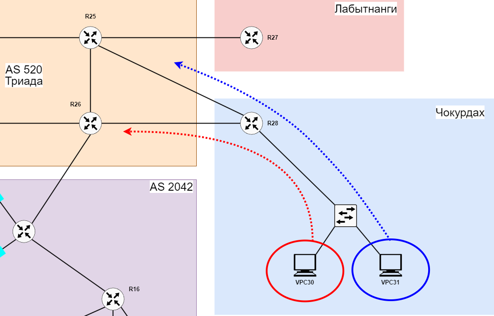

# Лабораторная работа 5. Маршрутизация на основе политик (PBR) 
### Цели
1. Настроить для офиса Лабытнанги маршрут по-умолчанию.
2. Настроить политику маршрутизации в офисе Чокурдах
3. Распределить трафик между 2 линками

В этой самостоятельной работе мы ожидаем, что вы самостоятельно:

Настроите политику маршрутизации для сетей офиса.
Распределите трафик между двумя линками с провайдером.
Настроите отслеживание линка через технологию IP SLA.(только для IPv4)
Настройте для офиса Лабытнанги маршрут по-умолчанию.

### Лабытнанги
На R27 настроим статический маршрут по-умолчанию. Его можно записать несколькими способами:
1. ```ip route 0.0.0.0 0.0.0.0 200.200.200.217```
2. ```ip route 0.0.0.0 0.0.0.0 e0/0```
3. ```ip route 0.0.0.0 0.0.0.0 200.200.200.217 e0/0```  

В случае первого варианта роутер не будет знать выходного интерфейса и будет происходить рекурсивная маршрутизация. Однако при помощи CEF роутеру не придется каждый раз производить рекурсивную маршрутизацию. Во втором случае роутер не будет знать IP-адрес следующего перехода (его нужно знать чтобы сформировать IP-пакет) и поэтому будет слать ARP-запросы. В случае, если на другом конце ему нието не ответит, то и пакет он переслать не сможет. Третий вариант кажется более предпочтителен, так как указаны и next-hop и выходной интерфейс. Но, со временем на роутере может поменяться выходной интерфейс и тогда роутер будет маршрутизировать пакеты в другую сеть. Запишем статический маршрут по-умолчанию на примере первого варианта и зададим ему комментарий:
```
R27>en
R27#conf t
R27(config)#ip route 0.0.0.0 0.0.0.0 200.200.200.217 name to_R25
```
Проверим таблицу маршрутизации и IP связность с роутером R25:  



### Чокурдах
По смыслу условия задачи исходящий трафик в этом офисе нужно распределить между двумя линками на маршрутизаторе R28 (через e0/0 к R26 и через e0/1 к R25). Распределять трафик будем на основе VLAN сетей в данном сегменте: VPC30 из VLAN 30 будет иметь доступ в другие сети через R26, а VPC31 из VLAN 31 через R25:



Настроим IP SLA, который будет проверять доступность next-hop 200.200.200.225:
```
R28(config)#ip sla 30
R28(config-ip-sla)#icmp-echo 200.200.200.225 source-interface e0/0
R28(config-ip-sla-echo)#frequency 10
R28(config)#ip sla schedule 30 life forever start-time now
```
Инициализируем объект отслеживание и привяжем его к созданному экземпляру IP SLA:
```
R28(config)#track 30 ip sla 30
```
Создадим access-list, где укажем IP адрес VPC30, для которого далее сконфигурируем политику маршрутизации:
```
R28(config)#ip access-list extended for_VPC-30
R28(config-ext-nacl)#permit ip host 179.140.30.100 any
```
Создаем маршрутуную карту, где матчим VPC30 и отправляем его пакеты на next-hop 200.200.200.225 если track 30 находится в Up:
```
R28(config)#route-map Primary_route_for_VPC-30 permit 10
R28(config-route-map)#match ip address for_VPC-30
R28(config-route-map)#set ip next-hop verify-availability 200.200.200.225 1 track 30
```
Применяем эту политику на субинтерфейсе, смотрящем на клиента:
```
R28(config)#int e0/2.30
R28(config-if)#ip policy route-map Primary_route_for_VPC-30
```
