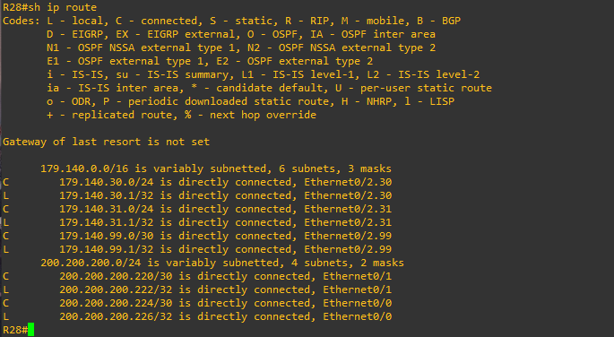
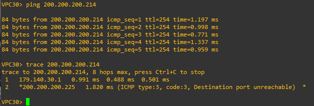
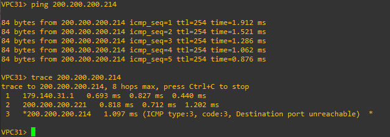
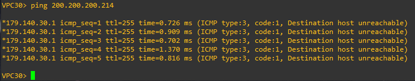
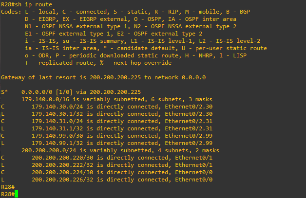
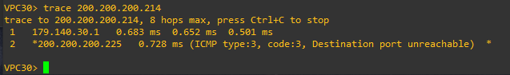
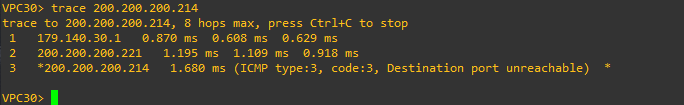
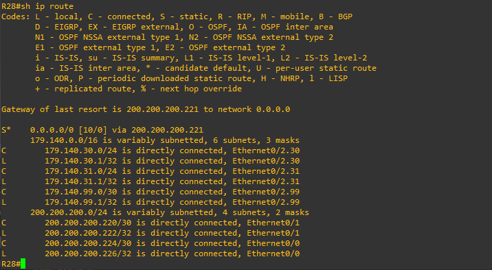

# Лабораторная работа 5. Маршрутизация на основе политик (PBR) 
### Цели
1. Настроить для офиса Лабытнанги маршрут по-умолчанию.
2. Настроить политику маршрутизации в офисе Чокурдах
3. Распределить трафик между 2 линками

В этой самостоятельной работе мы ожидаем, что вы самостоятельно:

Настроите политику маршрутизации для сетей офиса.
Распределите трафик между двумя линками с провайдером.
Настроите отслеживание линка через технологию IP SLA.(только для IPv4)
Настройте для офиса Лабытнанги маршрут по-умолчанию.

### Лабытнанги
На R27 настроим статический маршрут по-умолчанию. Его можно записать несколькими способами:
1. ```ip route 0.0.0.0 0.0.0.0 200.200.200.217```
2. ```ip route 0.0.0.0 0.0.0.0 e0/0```
3. ```ip route 0.0.0.0 0.0.0.0 200.200.200.217 e0/0```  

В случае первого варианта роутер не будет знать выходного интерфейса и будет происходить рекурсивная маршрутизация. Однако при помощи CEF роутеру не придется каждый раз производить рекурсивную маршрутизацию. Во втором случае роутер не будет знать IP-адрес следующего перехода (его нужно знать чтобы сформировать IP-пакет) и поэтому будет слать ARP-запросы. В случае, если на другом конце ему нието не ответит, то и пакет он переслать не сможет. Третий вариант кажется более предпочтителен, так как указаны и next-hop и выходной интерфейс. Но, со временем на роутере может поменяться выходной интерфейс и тогда роутер будет маршрутизировать пакеты в другую сеть. Запишем статический маршрут по-умолчанию на примере первого варианта и зададим ему комментарий:
```
R27>en
R27#conf t
R27(config)#ip route 0.0.0.0 0.0.0.0 200.200.200.217 name to_R25
```
Проверим таблицу маршрутизации и IP связность с роутером R25:  


### Чокурдах
По смыслу условия задачи исходящий трафик в этом офисе нужно распределить между двумя линками на маршрутизаторе R28 (через e0/0 к R26 и через e0/1 к R25). Распределять трафик будем на основе VLAN сетей в данном сегменте: VPC30 из VLAN 30 будет иметь доступ в другие сети через R26, а VPC31 из VLAN 31 через R25:


Сперва настроим политику для VPC30. Создадим IP SLA, который будет проверять доступность next-hop 200.200.200.225:
```
R28(config)#ip sla 30
R28(config-ip-sla)#icmp-echo 200.200.200.225 source-interface e0/0
R28(config-ip-sla-echo)#frequency 10
R28(config)#ip sla schedule 30 life forever start-time now
```
Инициализируем объект отслеживание и привяжем его к созданному экземпляру IP SLA:
```
R28(config)#track 30 ip sla 30
```
Создадим access-list, где укажем IP адрес VPC30, для которого далее сконфигурируем политику маршрутизации:
```
R28(config)#ip access-list extended for_VPC-30
R28(config-ext-nacl)#permit ip host 179.140.30.100 any
```
Создаем маршрутуную карту, где матчим VPC30 и отправляем его пакеты на next-hop 200.200.200.225 если track 30 находится в Up:
```
R28(config)#route-map Primary_route_for_VPC-30 permit 10
R28(config-route-map)#match ip address for_VPC-30
R28(config-route-map)#set ip next-hop verify-availability 200.200.200.225 1 track 30
```
Применяем эту политику на субинтерфейсе, смотрящем на клиента:
```
R28(config)#int e0/2.30
R28(config-if)#ip policy route-map Primary_route_for_VPC-30
```
Политика распределения трафика для VPC31 настраивается аналогично:
```
R28(config)#ip sla 31
R28(config-ip-sla)#icmp-echo 200.200.200.221 source-interface e0/1
R28(config-ip-sla-echo)#frequency 10
R28(config-ip-sla-echo)#exit
R28(config)#ip sla schedule 31 life forever start-time now
R28(config)#track 31 ip sla 31
R28(config)#ip access-list extended for_VPC-31
R28(config-ext-nacl)#permit ip host 179.140.31.100 any
R28(config-ext-nacl)#exit
R28(config)#route-map Primary_route_for_VPC-31 permit 10
R28(config-route-map)#match ip address for_VPC-31
R28(config-route-map)#set ip next-hop verify-availability 200.200.200.221 1 track 31
R28(config-route-map)#exit
R28(config)#int e0/2.31
R28(config-if)#ip policy route-map Primary_route_for_VPC-31
```
### Проверка PBR
Перед проверкой убедимся, что в таблице маршрутизации нет никаких маршрутов, помимо connected:  



Следовательно, пакеты от VPC30 и VPC31 должны маршрутизироваться исключительно с помощью PBR. С VPC30 проверим доступность до интерфейса e0/2 R26, а также посмотрим на трассировку:  



Результат успешный. Теперь сделаем тоже самое для VPC31:   



Теперь сымитируем проблему на R26 и отключим порт e0/1, на который идет трафик от VPC30 и еще раз проверим пинг от VPC30 до порта e0/2 R26:
```
R26#conf t
Enter configuration commands, one per line.  End with CNTL/Z.
R26(config)#int e0/1
R26(config-if)#sh
```



Результат отрицательный. Это потому, что трафик от VPC30 по политике идет на R26, на котором мы выключили интерфейс и в таблице маршрутизации нет статических маршрутов. Важно понимать, что если пакет не попал под ```match``` маршрутной карты, то он будет переслан с помощью таблицы маршрутизации. Исправим это и, в случае сбоя, заставим VPC30 и VPC31 идти по другому линку, настроив статические маршруты. Но условимся, что primary default static route будет идти до R26, а secondary static route - до R25. Если primary маршрут будет недоступен, то в таблицу маршрутизации добавится secondary маршрут (плавающий) до R25. Более того, если primary маршрут будет снова активен, то он заменит secondary маршрут. Сделаем это при помощи того же IP SLA.   

Основной маршрут будет проходить до R26 (200.200.200.225). Для этого мы будем периодически отправлять на него эхо-запросы для проверки доступности. У нас уже есть экземпляр ip sla 30, который пингует порт e0/1 R26, поэтому его же и привяжем к новому трэку track 1:
```
R28(config)#track 1 ip sla 30 reachability
```
Создадим primary маршрут:
```
R28(config)#ip route 0.0.0.0 0.0.0.0 200.200.200.225 track 1 name primary_route
```
Эта запись значит, что маршрут будет находиться в таблице маршрутизации, только если R26 доступен и, соответственно, track 1 находится в Up. Далее настроим secondary маршрут с увеличенным AD:
```
R28(config)#ip route 0.0.0.0 0.0.0.0 200.200.200.221 10 name secondary_route
```
### Проверка PBR + IP SLA
Проверим таблицу маршрутизации на R28:  



Выполним трассировку от VPC30 до e0/2 R26:   



Теперь отключим порт e0/1 R26 и еще раз выполним трассировку:   



Проверим таблицу маршрутизации:   



Мы видим, что track 1 ушел в Down и primary маршрут исчез из таблицы маршрутизации, а вместо него появился secondary маршрут с AD=10 и next-hop 200.200.200.221 до R25. Таким образом IP связность с внешней сетью для VPC30 не нарушилась. 
