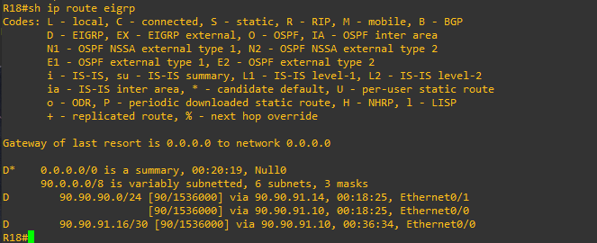
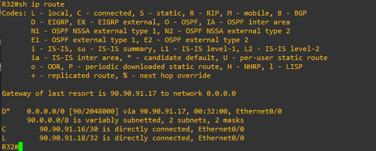

# Лабораторная работа 8. EIGRP.
### Цели
1. В офисе С.-Петербург настроить EIGRP.
2. R32 получает только маршрут по умолчанию.
3. R16-17 анонсируют только суммарные префиксы.
4. Использовать EIGRP named-mode для настройки сети.
### 1. Базовая настройка EIGRP named-mode на роутерах
```
R18>en
R18#conf t
R18(config)#router eigrp NG
R18(config-router)#address-family ipv4 unicast autonomous-system 1
R18(config-router-af)#no shutdown
R18(config-router-af)#network 90.90.91.8 255.255.255.252
R18(config-router-af)#network 90.90.91.12 255.255.255.252
```
```
R17>en
R17#conf t
R17(config)#router eigrp NG
R17(config-router)#address-family ipv4 unicast autonomous-system 1
R17(config-router-af)#no sh
R17(config-router-af)#network 90.90.91.12 255.255.255.252
R17(config-router-af)#network 90.90.90.0 255.255.255.128
R17(config-router-af)#network 90.90.90.128 255.255.255.128
```
```
R16#conf t
R16(config)#router eigrp NG
R16(config-router)#address-family ipv4 unicast autonomous-system 1
R16(config-router-af)#no sh
R16(config-router-af)#network 90.90.91.8 255.255.255.252
R16(config-router-af)#network 90.90.91.16 255.255.255.252
R16(config-router-af)#network 90.90.90.0 255.255.255.128
R16(config-router-af)#network 90.90.90.128 255.255.255.128
```
```
R32#conf t
R32(config)#router eigrp NG
R32(config-router)#address-family ipv4 unicast autonomous-system 1
R32(config-router-af)#no sh
R32(config-router-af)#network 90.90.91.16 255.255.255.252
```
### 2. Настроить R16-17 так, чтобы они анонсировали только суммарные префиксы.
```
R16(config)#router eigrp NG
R16(config-router)#address-family ipv4 unicast autonomous-system 1
R16(config-router-af)#af-interface e0/1
R16(config-router-af-interface)#summary-address 90.90.90.0 255.255.255.0
```
```
R17(config)#router eigrp NG
R17(config-router)#address-family ipv4 unicast autonomous-system 1
R17(config-router-af)#af-interface e0/1
R17(config-router-af-interface)#summary-address 90.90.90.0 255.255.255.0
```
Проверим что теперь R18 получает суммарный маршрут от R16 и R17:



### 3. Настройка R32 для получения только маршрута по умолчанию.
Для этого на R18 настроим суммаризацию вида 0.0.0.0/0:
```
R18(config-router-af)#af-interface e0/0
R18(config-router-af-interface)#summary-address 0.0.0.0/0
R18(config-router-af)#ex
R18(config-router-af)#af-interface e0/1
R18(config-router-af-interface)#summary-address 0.0.0.0/0
```
Теперь на R32 разрешим добавлять в таблицу маршрутизации только суммарный маршрут 0.0.0.0/0 от R18:
```
R32(config)#access-list 10 permit 0.0.0.0 0.0.0.0
R32(config)#router eigrp NG
R32(config-router)#address-family ipv4 unicast autonomous-system 1
R32(config-router-af)#topology base
R32(config-router-af-topology)#distribute-list 10 in
```
Проверяем:


