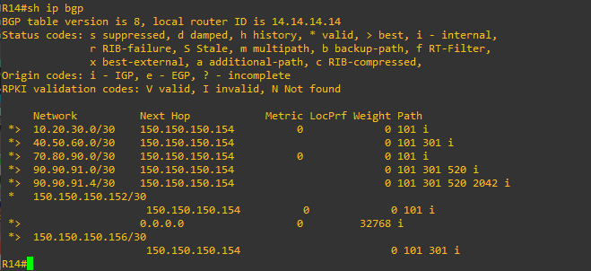
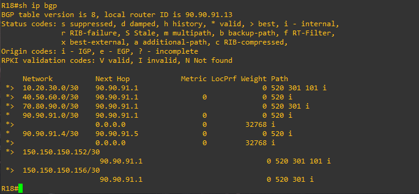
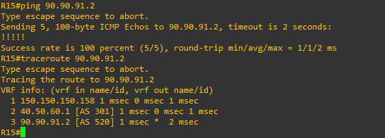

# Лабораторная работа 9. BGP. Продолжение
### Цели
1. Настроите eBGP между офисом Москва и двумя провайдерами - Киторн и Ламас.
2. Настроите eBGP между провайдерами Киторн и Ламас.
3. Настроите eBGP между Ламас и Триада.
4. Настроите eBGP между офисом С.-Петербург и провайдером Триада.
5. Организуете IP доступность между пограничным роутерами офисами Москва и С.-Петербург.
### 1. Настройка eBGP на роутерах в Москве, Киторн, Ламас, Триада и С.-Петербург
```
R14#conf t
R14(config)#router bgp 1001
R14(config-router)#neighbor 150.150.150.154 remote-as 101
R14(config-router)#network 150.150.150.152 mask 255.255.255.252
```
```
R15#conf t
R15(config)#router bgp 1001
R15(config-router)#neighbor 150.150.150.158 remote-as 301
R15(config-router)#network 150.150.150.156 mask 255.255.255.252
```
```
R22#conf t
R22(config)#router bgp 101
R22(config-router)#neighbor 150.150.150.153 remote-as 1001
R22(config-router)#network 150.150.150.152 mask 255.255.255.252
R22(config-router)#neighbor 70.80.90.2 remote-as 301
R22(config-router)#network 70.80.90.0 mask 255.255.255.252
R22(config-router)#neighbor 10.20.30.1 remote-as 520
R22(config-router)#network 10.20.30.0 mask 255.255.255.252
```
```
R21(config)#router bgp 301
R21(config-router)#neighbor 70.80.90.1 remote-as 101
R21(config-router)#neighbor 40.50.60.1 remote-as 520
R21(config-router)#neighbor 150.150.150.157 remote-as 1001
R21(config-router)#network 70.80.90.0 mask 255.255.255.252
R21(config-router)#network 40.50.60.0 mask 255.255.255.252
R21(config-router)#network 150.150.150.156 mask 255.255.255.252
```
```
R23#conf t
R23(config)#router bgp 520
R23(config-router)#neighbor 10.20.30.2 remote-as 101
R23(config-router)#network 10.20.30.0 mask 255.255.255.252
```
```
R24#conf t
R24(config)#router bgp 520
R24(config-router)#neighbor 40.50.60.2 remote-as 301
R24(config-router)#network 40.50.60.0 mask 255.255.255.252
R24(config-router)#neighbor 90.90.91.2 remote-as 2042
R24(config-router)#network 90.90.91.0 mask 255.255.255.252
```
```
R18#conf t
R18(config)#router bgp 2042
R18(config-router)#neighbor 90.90.91.1 remote-as 520
R18(config-router)#neighbor 90.90.91.5 remote-as 520
R18(config-router)#network 90.90.91.0 mask 255.255.255.252
R18(config-router)#network 90.90.91.4 mask 255.255.255.252
```
```
R26#conf t
R26(config)#router bgp 520
R26(config-router)#neighbor 90.90.91.6 remote-as 2042
R26(config-router)#network 90.90.91.4 mask 255.255.255.252
```
### 2. Проверка IP связности между Москвой и С.-Петербургом
Проверим Local RIB на R14 в Москве: 



Проверим Local RIB на R18 в С.-Петербург: 



Проверим доступность R18 в С.-Петербург с R15 в Москве:


